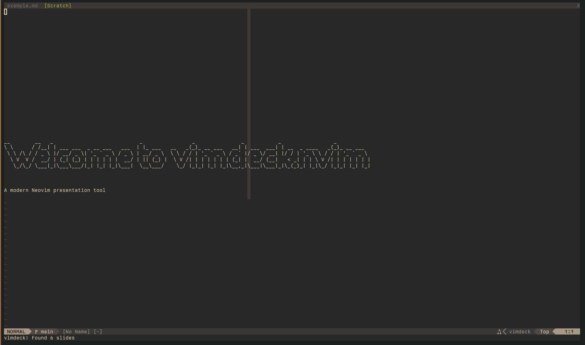
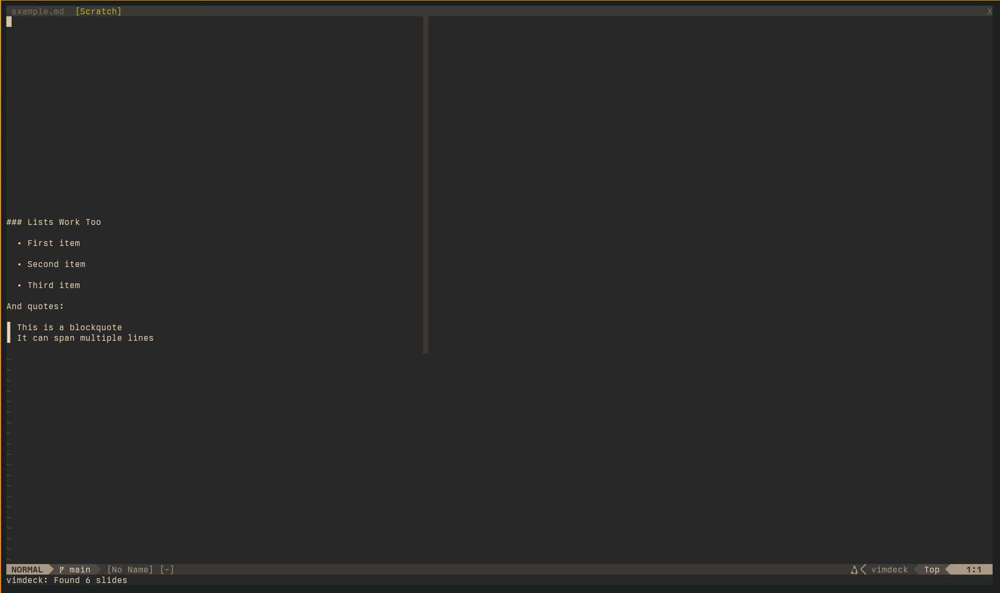
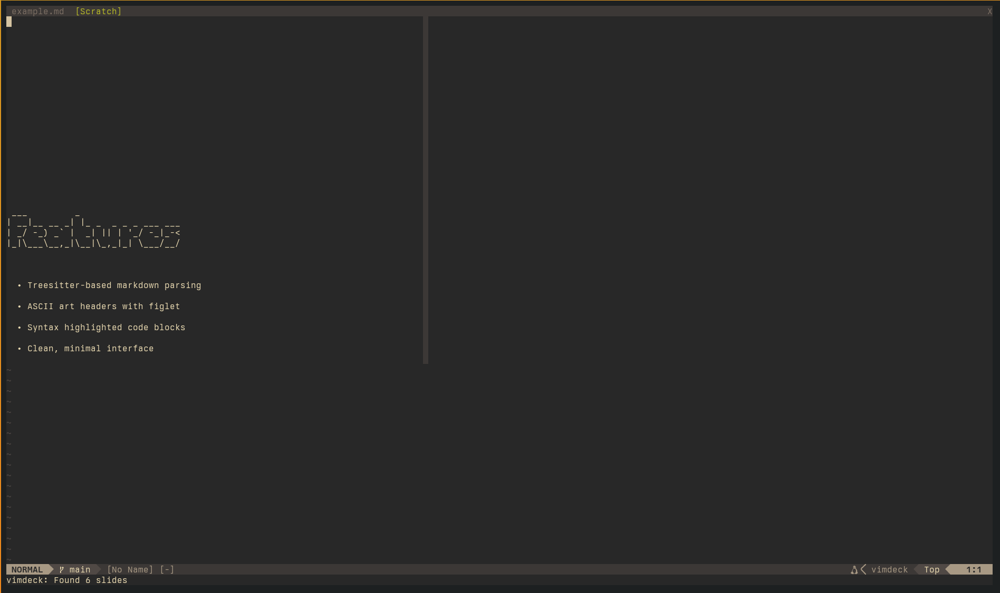
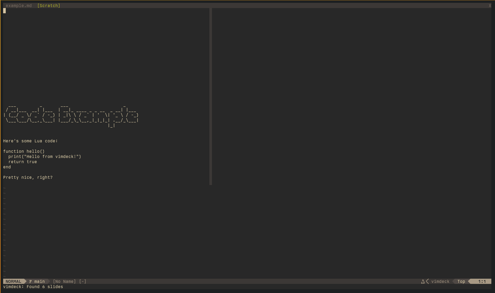
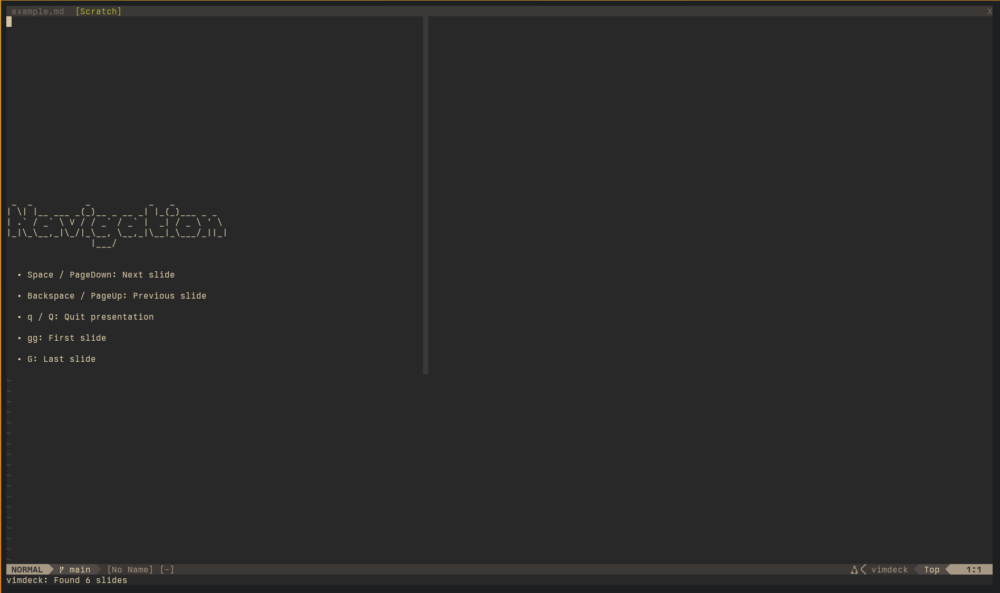

# vimdeck.nvim

A modern Neovim plugin for creating presentations from markdown files.
Inspired by the original vimdeck, rewritten from scratch using Treesitter
and native Neovim features.





## Features

- Treesitter-based markdown parsing (no external dependencies)
- ASCII art headers using figlet (h1 and h2)
- Syntax highlighted code blocks
- Support for all heading levels (h1-h6)
- Lists, blockquotes, and paragraphs
- Clean, distraction-free presentation mode
- Simple navigation with keyboard shortcuts

## Requirements

- Neovim 0.9+ (for Treesitter support)
- figlet (optional, for ASCII art headers)
- markdown Treesitter parser installed

## Installation

### Using lazy.nvim

```lua
{
  'ducks/vimdeck.nvim',
  cmd = { 'Vimdeck', 'VimdeckFile' },
  opts = {
    use_figlet = true,
    center_slides = true,
  }
}
```

### Using packer.nvim

```lua
use {
  'ducks/vimdeck.nvim',
  config = function()
    require('vimdeck').setup({
      use_figlet = true,
      center_slides = true,
    })
  end
}
```

### Install figlet

For ASCII art headers:

```bash
# macOS
brew install figlet

# Debian/Ubuntu
sudo apt install figlet

# Arch Linux
sudo pacman -S figlet

# NixOS (add to your shell.nix or configuration.nix)
pkgs.figlet
```

### Install markdown Treesitter parser

```vim
:TSInstall markdown markdown_inline
```

## Usage

### Creating Presentations

Write your presentation in markdown. Separate slides with horizontal
rules:

```markdown
# First Slide

This is the content

---

# Second Slide

More content here

---

## Last Slide

- Bullet points
- Work great
```

### Starting Presentations

From within Neovim:

```vim
# Open a markdown file and start presenting
:e presentation.md
:Vimdeck

# Or present a file directly
:VimdeckFile presentation.md
```

From Lua:

```lua
# Present current buffer
require('vimdeck').present()

# Present specific file
require('vimdeck').present_file('presentation.md')
```

### Navigation

While in presentation mode:

- Space / PageDown: Next slide
- Backspace / PageUp: Previous slide
- q / Q: Quit presentation
- gg: Jump to first slide
- G: Jump to last slide

## Markdown Support

### Headings

All heading levels (h1-h6) are supported. h1 and h2 are rendered as
ASCII art using figlet if available.

```markdown
# Big Title (ASCII art)
## Subtitle (ASCII art)
### Regular heading
```

### Code Blocks

Fenced code blocks with syntax highlighting:

````markdown
```lua
function hello()
  print("Hello!")
end
```
````

### Lists

```markdown
- Item one
- Item two
- Item three
```

### Blockquotes

```markdown
> This is a quote
> It spans multiple lines
```

## Configuration

```lua
require('vimdeck').setup({
  # Use figlet for ASCII art headers (default: true)
  use_figlet = true,

  # Center slides vertically (default: true)
  center_slides = true,
})
```

## Differences from Original vimdeck

The original vimdeck was a Ruby script that generated temporary files.
This plugin:

- Is a native Neovim plugin (no external script needed)
- Uses Treesitter for accurate markdown parsing
- Renders slides dynamically (no temp files)
- Leverages Neovim's built-in syntax highlighting
- Supports all markdown heading levels
- Faster and more integrated with Neovim

## Screenshots

<details>
<summary>Click to view screenshots</summary>


### Code Examples


### Lists and Formatting


### Final Slide


</details>

## Examples

See `example.md` for a sample presentation.

## License

MIT

## Credits

Inspired by the original vimdeck by Tyler Benziger.
